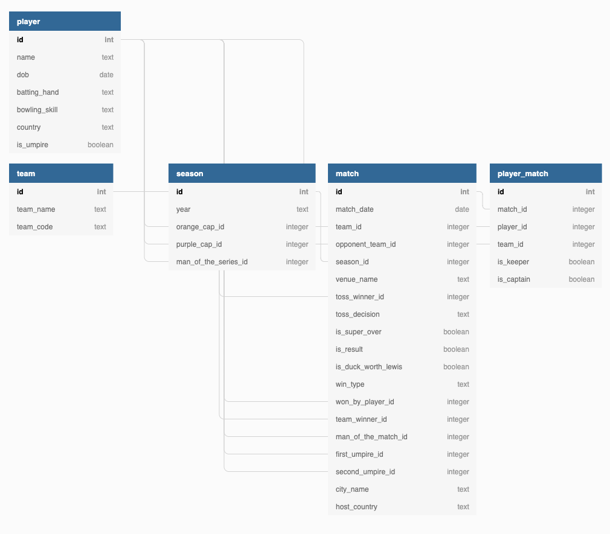

# 🚀 Graphql-cricket-league

Website: https://graphql-cricket-league-server.herokuapp.com/graphql </br>

App contain simple access to _Indian Premier League_ data by **graphql queries**. The basement
of application is `Apollo Server` associated with `Express.js`. There was used `schema first` approach
during development process. Playground by apollo server is exposes because of presentation purposes. 

Inside .db folder you can find a csv files to fill tables by data. There were created special migrations
to automate this process (more in how to run). For finding the right match that you looked for, **trigrams** 
were implemented. There were created indexes (`pg_trgm` module) which associate in match table between columns:
venueName, cityName and hostCountry. This approach make easier finding match by location. 


## How run local

1. Copy `.env.template` to `.env` in the same path.
2. Run `docker-compose up`

If you find problem with migration you can lunch it by yourself `npm run migration:up` or refresh server
to automatically execute migration commands. (Application sometimes try to run migrations commands before
full database initialization. To resolve it you can use upper approach or 
use https://raw.githubusercontent.com/vishnubob/wait-for-it/master/wait-for-it.sh or increase timeout for 
database connection in app.)

## Useful queries

### Matches
#### Query
```graphql
query Matches($matchPlace: String!) {
  matches(matchPlace: $matchPlace) {
    cityName
    hostCountry
    venueName
    id
    matchDate
  }
}
```
#### Variables

Pay attention to value `ramchi`. There is an incorrect **cityName** because the correct
is `Ranchi` by **n** not **m**. Trigrams make job on this query and try to 
find the most
appropriate records for provided arguments.

```json
{
  "matchPlace": "ramchi"
}
```

#### Example Response
```
{
  "data": {
    "matches": [
      {
        "cityName": "Ranchi",
        "hostCountry": "India",
        "venueName": "JSCA International Stadium Complex",
        "id": 598062,
        "matchDate": "2013-05-12"
      },
      ...
    ]
  }
}
```
___

### Player
#### Query
```graphql
query Players($playerId: Int!) {
  player(playerId: $playerId) {
    id
    name
    country

    playedMatches {
      isCaptain
      isKeeper

      team {
        teamCode
        teamName
      }

      match {
        matchDate
        cityName
        hostCountry
        season {
          year
        }
      }
    }
  }
}
```
#### Variables
```json
{
  "playerId": 3
}
```
___

### Players
#### Query
```graphql
query Players($pagination: Pagination!) {
  players(pagination: $pagination) {
    name
    dob
    country
    isUmpire
    playedMatches {
      match {
        matchDate
        season {
          year
        }
        winType
        cityName
        hostCountry
      }
      isKeeper
      isCaptain
      team {
        teamName
        teamCode
      }
    }
    battingHand
    bowlingSkill
  }
}
```

#### Variables
```json
{
  "pagination": {
    "offset": 0,
    "limit": 10
  }
}
```
___

### Team
#### Query
```graphql
query Team($teamId: Int!) {
    team(teamId: $teamId) {
        id
        teamCode
        teamName
    }
}
```
#### Variables
```json
{
  "teamId": 3
}
```
___

### Teams
#### Query
```graphql
query Teams {
  teams {
    id
    teamName
    teamCode
  }
}
```